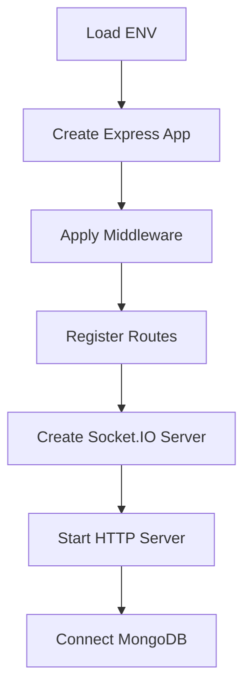
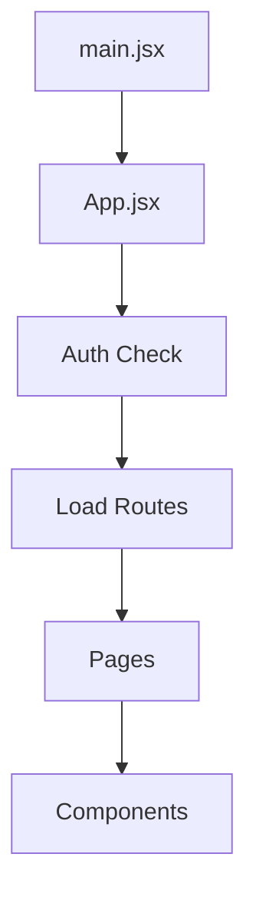
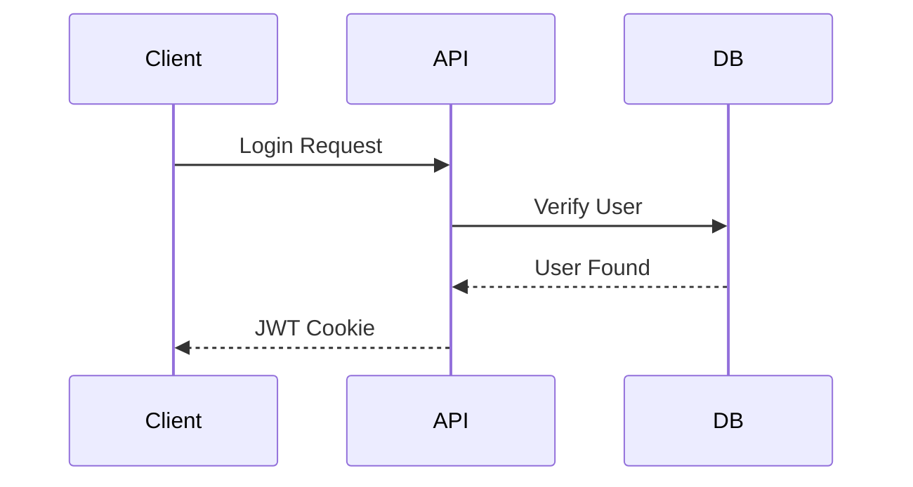
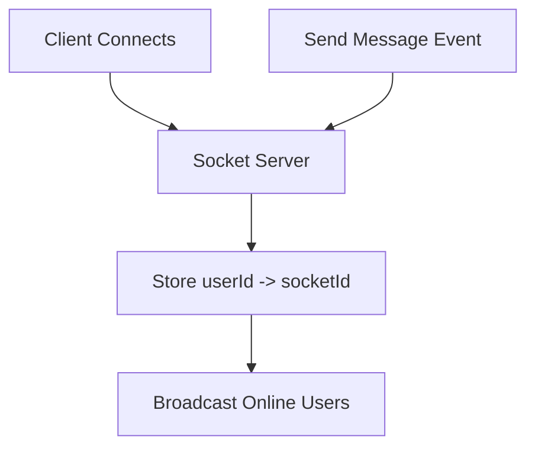
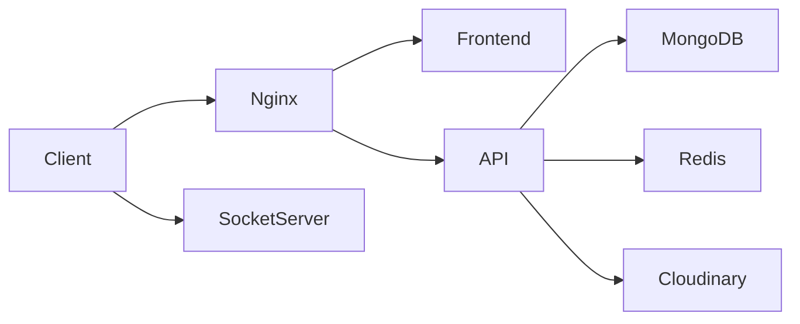

# Chat App — Complete Technical Documentation

## 1. Project Overview

### Project Name

`chat-app`

### Purpose

A full-stack real-time chat application that supports authentication, live messaging, online user tracking, image uploads, profile management, and responsive UI themes.

### Core Features

- User authentication (Signup/Login/Logout)
- JWT authentication with HTTP-only cookies
- Real-time messaging using Socket.IO
- Online/offline user presence
- Image upload support via Cloudinary
- User profile updates
- Modern responsive UI with Tailwind + DaisyUI
- Persistent frontend state using Zustand

### Architecture

- **Frontend**: React SPA (Single Page Application)
- **Backend**: Express REST API + Socket.IO realtime server
- **Database**: MongoDB with Mongoose ODM
- **Communication**:
  - REST APIs for CRUD/auth
  - WebSockets for realtime events

### Tech Stack

| Layer            | Technology             |
| ---------------- | ---------------------- |
| Frontend         | React 19 + Vite        |
| Styling          | Tailwind CSS + DaisyUI |
| State Management | Zustand                |
| Backend          | Node.js + Express 5    |
| Database         | MongoDB                |
| ODM              | Mongoose               |
| Realtime         | Socket.IO              |
| Authentication   | JWT + Cookies          |
| File Uploads     | Cloudinary             |

---

# 2. Project Structure

```txt
chat-app/
│
├── backend/
│   ├── src/
│   │   ├── controllers/
│   │   ├── middleware/
│   │   ├── models/
│   │   ├── routes/
│   │   ├── lib/
│   │   └── server.js
│   │
│   ├── package.json
│   └── package-lock.json
│
├── frontend/
│   ├── src/
│   │   ├── components/
│   │   ├── pages/
│   │   ├── store/
│   │   ├── lib/
│   │   ├── constants/
│   │   ├── App.jsx
│   │   └── main.jsx
│   │
│   ├── index.html
│   ├── vite.config.js
│   ├── tailwind.config.js
│   ├── postcss.config.js
│   ├── eslint.config.js
│   ├── package.json
│   └── package-lock.json
│
└── .gitignore
```

---

# 3. Backend Architecture

## Entry Point

### `backend/src/server.js`

Responsible for:

- Loading environment variables
- Configuring Express middleware
- Registering routes
- Initializing Socket.IO server
- Starting HTTP server
- Connecting MongoDB

### Server Initialization Flow



---

# 4. Backend Dependencies

| Package       | Version | Purpose              | Usage                 |
| ------------- | ------- | -------------------- | --------------------- |
| bcryptjs      | 3.0.3   | Password hashing     | Auth system           |
| cloudinary    | 2.10.0  | Image uploads        | Profile/messages      |
| cookie-parser | 1.4.7   | Parse cookies        | JWT auth              |
| cors          | 2.8.6   | Cross-origin support | Frontend requests     |
| dotenv        | 17.4.2  | ENV config           | Entire backend        |
| express       | 5.2.1   | API server           | Core backend          |
| jsonwebtoken  | 9.0.3   | JWT auth             | Login/auth middleware |
| mongoose      | 9.6.1   | MongoDB ODM          | Database layer        |
| socket.io     | 4.8.3   | Real-time messaging  | Chat system           |
| nodemon       | 3.1.14  | Dev auto-reload      | Development           |

---

# 5. Frontend Dependencies

## Runtime Dependencies

| Package          | Version | Purpose             |
| ---------------- | ------- | ------------------- |
| axios            | 1.16.0  | API requests        |
| lucide-react     | 1.14.0  | Icons               |
| react            | 19.2.6  | UI framework        |
| react-dom        | 19.2.6  | React rendering     |
| react-hot-toast  | 2.6.0   | Toast notifications |
| react-router-dom | 7.15.0  | Routing             |
| socket.io-client | 4.8.3   | Realtime connection |
| zustand          | 5.0.13  | State management    |

## Development Dependencies

| Package                     | Version | Purpose               |
| --------------------------- | ------- | --------------------- |
| @eslint/js                  | 10.0.1  | ESLint config         |
| @vitejs/plugin-react        | 6.0.1   | React support in Vite |
| autoprefixer                | 10.5.0  | CSS compatibility     |
| daisyui                     | 4.12.24 | UI theme system       |
| eslint                      | 10.2.1  | Linting               |
| eslint-plugin-react-hooks   | 7.1.1   | Hook validation       |
| eslint-plugin-react-refresh | 0.5.2   | Fast refresh linting  |
| globals                     | 17.5.0  | Browser globals       |
| postcss                     | 8.5.14  | CSS processing        |
| tailwindcss                 | 3.4.19  | Utility CSS           |
| vite                        | 8.0.10  | Build tool            |

---

# 6. Frontend Architecture

## Entry Point

### `frontend/src/main.jsx`

Responsibilities:

- Mount React app
- Initialize BrowserRouter
- Import global styles

---

## App Flow



---

# 7. Routing System

| Route       | Page         | Purpose           |
| ----------- | ------------ | ----------------- |
| `/`         | HomePage     | Main chat UI      |
| `/login`    | LoginPage    | User login        |
| `/signup`   | SignupPage   | User registration |
| `/profile`  | ProfilePage  | User profile      |
| `/settings` | SettingsPage | Theme settings    |

---

# 8. State Management (Zustand)

## `useAuthStore`

Handles:

- Authentication state
- Current user
- Online users
- Socket connection

### Stored State

```js
{
  (authUser, onlineUsers, socket, isCheckingAuth);
}
```

---

## `useChatStore`

Handles:

- User list
- Messages
- Selected chat
- Loading states

### Stored State

```js
{
  (users, messages, selectedUser);
}
```

---

# 9. Authentication System

## Flow



## Authentication Method

- JWT token stored in HTTP-only cookie

## Security Settings

```js
httpOnly: true;
sameSite: "strict";
secure: NODE_ENV !== "development";
```

---

# 10. Database Models

## User Model

### Fields

| Field      | Type   | Notes          |
| ---------- | ------ | -------------- |
| fullName   | String | Required       |
| email      | String | Unique         |
| password   | String | Hashed         |
| profilePic | String | Cloudinary URL |

---

## Message Model

### Fields

| Field      | Type     |
| ---------- | -------- |
| senderId   | ObjectId |
| receiverId | ObjectId |
| text       | String   |
| image      | String   |

---

# 11. API Documentation

# Auth Routes

## `POST /api/auth/signup`

### Request

```json
{
  "fullName": "John Doe",
  "email": "john@example.com",
  "password": "123456"
}
```

### Response

```json
{
  "_id": "...",
  "fullName": "John Doe",
  "email": "john@example.com"
}
```

---

## `POST /api/auth/login`

### Request

```json
{
  "email": "john@example.com",
  "password": "123456"
}
```

---

## `POST /api/auth/logout`

Clears JWT cookie.

---

## `GET /api/auth/check`

Returns authenticated user.

---

## `PUT /api/auth/update-profile`

Uploads profile image to Cloudinary.

---

# Message Routes

## `GET /api/messages/users`

Returns sidebar users.

---

## `GET /api/messages/:id`

Returns conversation messages.

---

## `POST /api/messages/send/:id`

Creates new message.

Supports:

- text
- image

---

# 12. Real-Time System

## Socket.IO Flow



## Online Presence

- Users stored in in-memory map
- Broadcasts active users to all clients

## Message Delivery

- Receiver socket located using `userId`
- Emits `newMessage`

---

# 13. Environment Variables

## Backend

| Variable              | Purpose            |
| --------------------- | ------------------ |
| PORT                  | Server port        |
| MONGODB_URI           | MongoDB connection |
| JWT_SECRET            | JWT signing        |
| CLOUDINARY_CLOUD_NAME | Cloudinary         |
| CLOUDINARY_API_KEY    | Cloudinary         |
| CLOUDINARY_API_SECRET | Cloudinary         |
| NODE_ENV              | Environment mode   |

---

# 14. Build System

## Frontend

### Development

```bash
npm run dev
```

### Production

```bash
npm run build
```

---

## Backend

### Development

```bash
npm run dev
```

### Production

```bash
npm start
```

---

# 15. Styling System

## Tailwind CSS

Used for utility-first styling.

## DaisyUI

Provides:

- Themes
- Buttons
- Cards
- Chat UI components

## Theme Switching

Stored in localStorage using Zustand.

---

# 16. Performance Review

## Current Strengths

- Vite provides fast HMR
- Zustand minimizes unnecessary renders
- Socket.IO efficient for realtime updates

## Current Weaknesses

- No pagination for messages
- No MongoDB indexes
- Full user list fetched every request
- No caching layer
- Images sent as base64 strings

---

# 17. Security Review

## Good Practices

- Password hashing with bcrypt
- HTTP-only cookies
- Protected routes
- Secure cookies in production

## Risks

- No request rate limiting
- No schema validation library
- No CSRF token
- JWT errors incorrectly return 500
- No upload size validation

---

# 18. Bugs & Issues Found

| Issue                           | Location           | Severity |
| ------------------------------- | ------------------ | -------- |
| `isUsersLoading` typo           | Sidebar.jsx        | Medium   |
| DB connects after server starts | server.js          | Medium   |
| JWT middleware returns 500      | auth.middleware.js | High     |
| No pagination                   | messages API       | Medium   |
| No indexes                      | MongoDB            | High     |

---

# 19. Recommended Improvements

## Immediate Fixes

1. Fix loading state typo
2. Return 401 for invalid JWT
3. Add message sorting
4. Add MongoDB indexes
5. Add pagination

---

## Backend Improvements

- Add validation using Zod/Joi
- Add centralized error middleware
- Add logging system
- Add rate limiting
- Add Redis for scalable sockets

---

## Frontend Improvements

- Add React Query/TanStack Query
- Add optimistic UI updates
- Add error boundaries
- Add lazy loading
- Add skeleton loaders

---

## DevOps Improvements

- Add Docker
- Add docker-compose
- Add CI/CD
- Add GitHub Actions
- Add environment examples

---

# 20. Suggested Database Indexes

```js
messageSchema.index({
  senderId: 1,
  receiverId: 1,
  createdAt: -1,
});
```

```js
userSchema.index({
  email: 1,
});
```

---

# 21. Suggested Production Architecture



---
